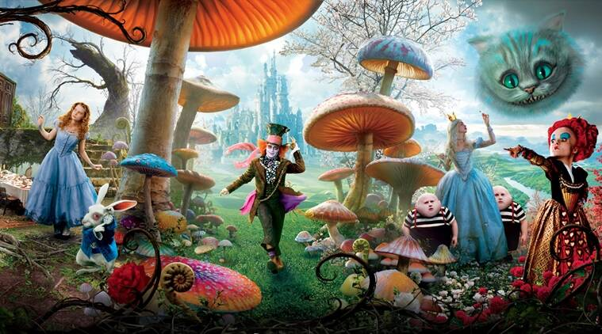

Git intro
=========

# The Basics

Start working on the book:

- create a directory `Alice` and enter it
- create a file `book.md` with the following:

	Alice in Wonderland
	===================
	A story about a girl entering a magical world.

Initialize git repository

	git init    # initialize the repository

Show the git repository in `.git`

	git status 				# check the status
	git status -s 
	

Commit the first change to the repository:

	git add .
	git status -s
	git commit -m "Initial version"

Fix the metadata (configure git:)

	git log 

	git config --global user.name “Piotr Szul”
	git config --global user.email piotr.szul@csiro.au

	git commit --amend --reset-author

Check the history:

	git log 
	git log --oneline

Open `gihub desktop` and check the visual represntation of the history.

Add the first chapter to `book.html`:

	Chapter 1:  Down the Rabbit Hole

	Alice follows a White Rabbit down the rabbit hole.

Check status and diff and stage the file

	git status -s
	git diff

	git add .				# stage the changes

	git status -s
	git diff				# diff agains staged fileds
	git diff HEAD			# diff against the most recent commit (HEAD)

Use pandoc to create compiled book html

	pandoc book.md -s -o output.html
	open output.html

Notice the formatting is incorrect and fix it:

	# Chapter 1:  Down the Rabbit Hole

Verify the formatting

	pandoc book.md -s -o output.html
	open output.html

Check the status and note the `output.html`

	git status -s

Ignore the 	`output.html`. Create file `.gitignore` with:

	output.html
	*.html

Commit changes:

	git status -s
	git add .
	git status -s
	git commit -m "Added chapter one; Ignored output.html"

	git log --oneline

	git show ....

Show the history in GUI.

Add birnary resources in subdirectory. (copy `assets`)

Modify `book.md`:

	

Preview and commit changes:

	pandoc book.md -s -o output.html
	open output.html
	git status -s

	git diff HEAD			# diff against the most recent commit (HEAD)
	git diff HEAD~1			# diff against the most HEAD -1
	git log --oneline		# get the ID of the first commit

	git diff <first-commit-hash>	#compare agains a specific commit

Commit with GUI

# Working with repositories

Create and setup repository 'alice' in github:

Setup SSH keys in github.

	ls ~/.ssh
	ssh-keygen # if needed

Initial `push`

	git push -set-... (as in github instructions)

Clone the repository into another location.

	git clone ...    AliceOther
	cd AliceSecond
	git log --oneline

Go back to `alice` and make and commit a changes in `book.html` and push the changes.

	# Chapter 3: The Red Queen

	git add .
	git commit -m "Added heading for chapter 3"

	git log --oneline

	Alice meets the Red Queen and gets jam every second day.

	git add .
	git commit -m "Added contents for chapter 3"

	git log --oneline

Publish the changes(check github first)

	git push #check the github history after

Get the changes to `AliceOther`

	cd ../AliceOther
	git log --oneline
	git pull
	git log --oneline

Note: This can be used to synchonize files between your local machine and HPC environment.

# Basic of conflict resolution

Make sure both 'alice' and 'AliceOther' are up to date:

	git status
	git pull
	git status

Go back to `alice` and make and commit a changes in `book.html` and push the changes.

	# Chapter 4: The Mock Turtle's Story
	Alice listens to the sad story of Mock Tutrle

	git add .
	git commit -m "Added Chapter 4"

	git push

Go back to `AliceOter` and make and commit a changes in `book.html` and push the changes.

	# Chapter 5:  Who Stole the Tart?
	Alice attends the trial.
	git add .

	git commit -m "Added Chapter 5"
	git push  # oops .... 

Resove the conflict:

	git pull
	>>  fix the file
	git add .
	git commit -m "Merged chapter 4"
	git push

# Working with history

Go back to `Alice` and pull the most recent changes

	git pull 
	git status
	git log --oneline

Restore changes in working tree

	rm book.md # oops 

	git status
	git restore .

	ls # uff

	git status  -s

	> add some text to book.md

	git status -s
	git diff

	git restore book.md

	git diff
	git status  -s

Restore changes in staged.

	> add some text to book.md
	git add .

	git status -s

	git diff  # does not show any changes! (compare agains stagning)

	git diff head 

	> make anoter change

	git status -s

	git diff HEAD

	git status # shows helpful tips

	git restore --staged .  # unstage

	git status

	git restore . #  remove local changes

	git status

Clean up non-tracked files.

	touch junk.txt
	git status
	git restore .

	git clean -n 
	git clean -f

	git status

Rewite histry with reset. Do not do with pushed commits!

	> make and commit a wrong change
	git log  --oneline
	git reset HEAD~1
	git status -s 

What if already pushed?

	> make and commit a wrong change

	git push

	git log --oneline

	git revert HEAD

	git log --oneline

	git push

Other things

	git tag -a "v1.0" -m "Tagging version 1.0"
	
	git tag -l 

	git show v1.0
	
	git push --tags

